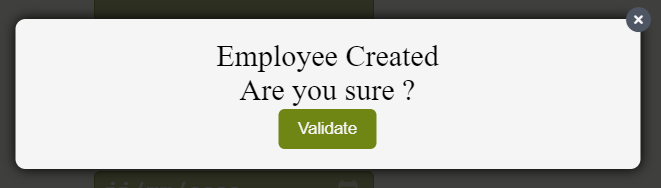

# React Plugin Modal Library:

react-plugin-modal:
It's a simple-component-library => A library of React Components created using `create-react-app`.

## Installation:

Run the following command: `npm install react-plugin-modal`.
You can consult more details about npm package on: -[react_modal_library](https://www.npmjs.com/package/react-plugin-modal)

### Utilisation:

I. Import react-plugin-modal library(component React) into your following code with: `import {Modal} from "react-plugin-modal"`.

II - This plugin contain props: `{ isOpen, onClose, handleValidate, text }`

.`isOpen`: can be use for open Modal.
.`onClose`: can be use for close Modal.
.`handleValidate`: can be use with fonction for validate choice.
.`text`: can be use for text or description.

an HTML tag `
` contain the title of the modal, you can change it into the code of Modal.jsx component.

### Example of Style Modal:

